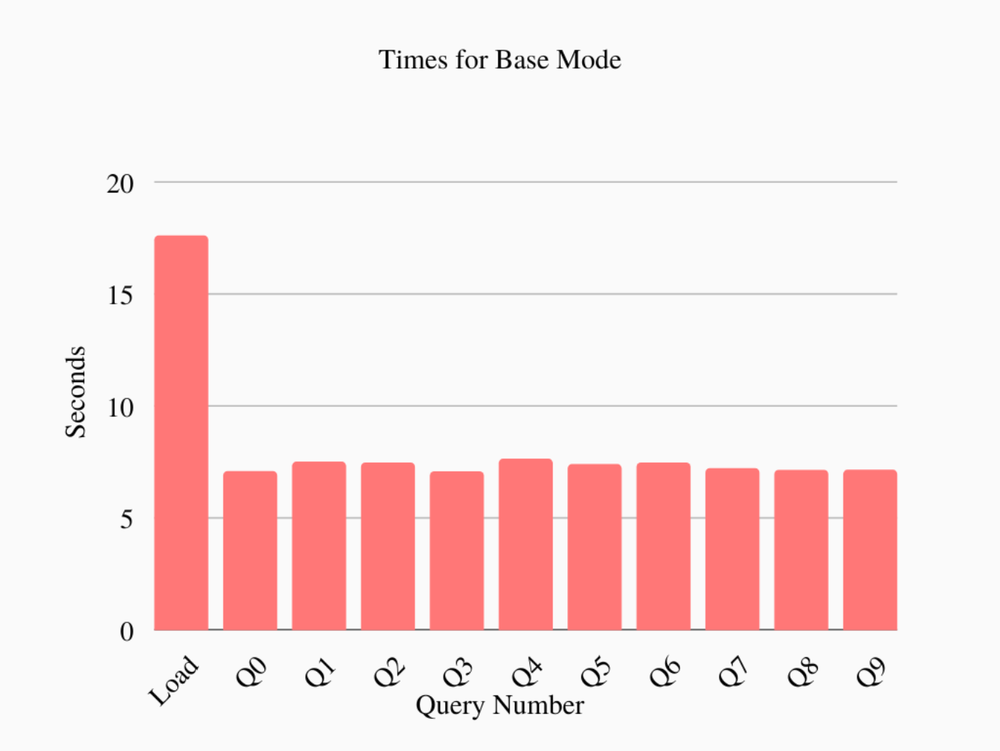
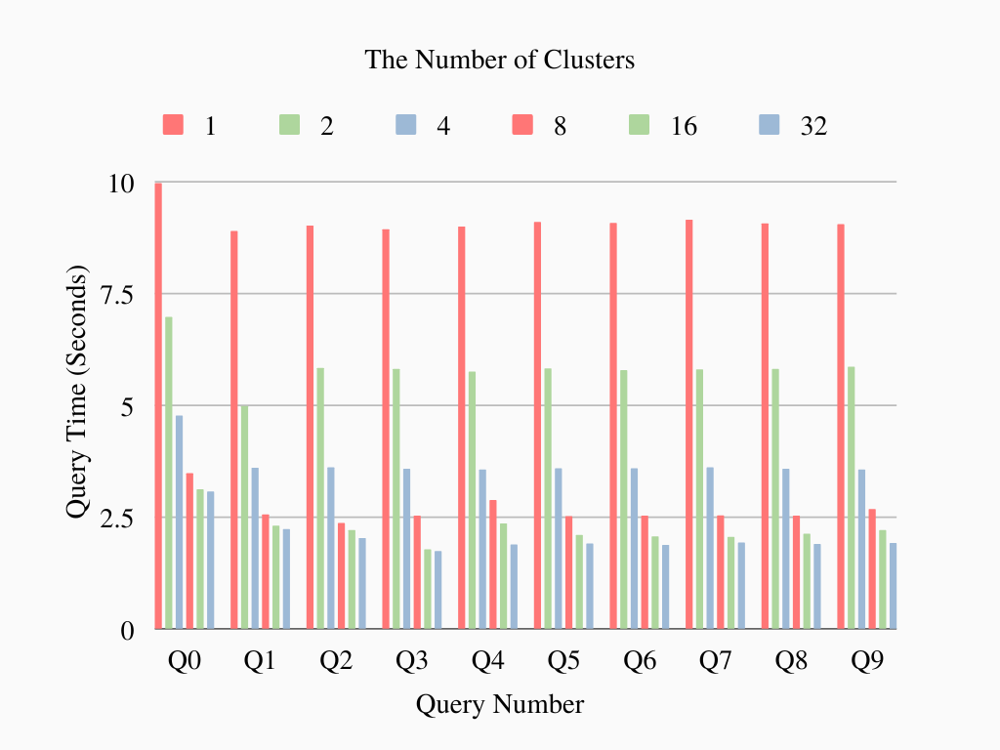
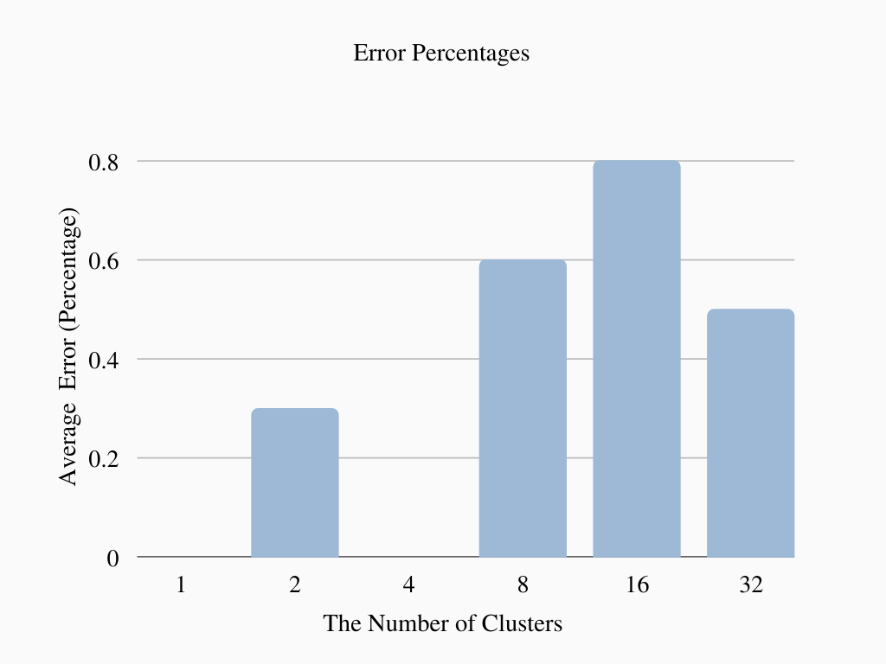

# Data Retrieval via NLP

## About
A search engine to look for certain files from the user.
Using machine learning and PyTorch to develop a model that can utilize NLP to search for and return relevant texts and images to the user's query.
Employs semantic embedding (for meaning rather than word frequency) and convolutional neural networks to retrieve data.

## Abstract
Modern devices allow users to search for certain files, but solely utilize the names of the files, instead of the contents stored within. As humanity progresses technologically, the increasing amounts of data will serve as a barrier to a practical application of the latter task in terms of time and cost. This will necessitate accurate methods for finding information in a timely and effective manner. In this work, we create a system to search for relevant content within texts and images in respect to a user’s queries utilizing NLP that is both productive and accurate when tested on over 300,000 sources of data.

## Prerequisites

**Installation**

Python Modules

```
pip install torch
pip install transformers
pip install tabulate
pip install numpy
pip install tqdm
pip install argparse
pip install sklearn
pip install PyPDF2
pip install pytesseract
pip install tqdm
pip install pdf2image
```

Tesseract OCR

```
sudo apt install tesseract-ocr
```

SpaCy Profile
```
python3 -m spacy download en_core_web_sm
```

## Usage

You will need pdf files to search through. You may download these sample [files](https://www.dropbox.com/sh/4gedwm2sc7ylsxf/AAB798H6sdVW4n9iV5TZWF5Qa?dl=0) or use your own. Store these source files in a directory. By default, this directory would be `/home/{user}/daviesearch/` on a Linux machine.

Then run `doc_retrieval.py`, which uses the following arguments:

- `--source`: path of folder with source files (default: /home/{user}/daviesearch/)
- `--data`: path of folder to store program data (default: /home/{user}/daviesearch_data/)
- `--query`: query to search for (optional: if not provided, will prompt for one while running)
- `--noscan`: disable scanning for new files in source directory to extract text and generate embeddings for, which is done by default (default: False)
- `--mode`: enable/disable optimization (default: base,0 - if you would like to enable optimization, use kmeans,4)

By default, each time you run the program, it will extract text and generate embeddings for any new sources (which will include everything when running this program for the first time). This may take a significant amount of time for large datasets.

## Results

The following are the results for the document retrieval speed up process.





## Future Work Ideas

- Multithreading
- Background program to automatically extract text and generate embeddings
